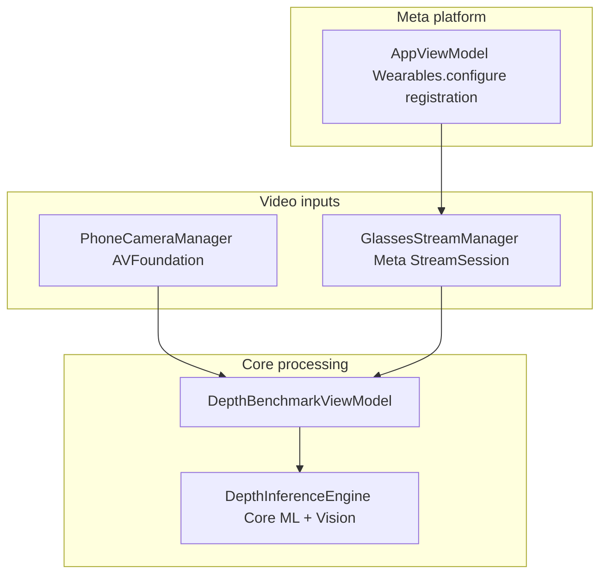

# depth-anything-ios — Project documentation

This document explains the repository layout, how the app works, how to set it up, and how the iPhone camera path and Meta Ray-Ban path fit together.

---

## What this project is

An iOS app that runs **Depth Anything V2 Small** as a **Core ML** model to estimate **per-frame depth** from a live camera. You can use:

- The **iPhone rear camera**, or  
- **Meta Ray-Ban / AI glasses** video streamed through Meta’s **Wearables Device Access Toolkit (DAT)** for iOS.

The UI shows the live feed, an optional **Turbo colormap** depth overlay (red ≈ near, blue ≈ far), and **latency stats** (current / average / min / max frame time in milliseconds).


### VisionClaw tab (Gemini + WebRTC)

The same binary includes a second tab (**Vision**) with the [VisionClaw](https://github.com/sseanliu/VisionClaw) CameraAccess sample (Gemini Live, OpenClaw tools, WebRTC POV streaming). Sources live under `DepthanythingTest/DepthanythingTest/VisionClaw/`. Upstream reference tree: `DepthanythingTest/Vendor/VisionClaw/`.

- **Meta DAT:** `Wearables.configure()` runs once in `DepthanythingTestApp.init()`; both tabs share `Wearables.shared`.
- **OAuth:** Use a single `onOpenURL` on the root (`depthanythingtest://`); align **Meta Developer** app URL scheme with `Info.plist`.
- **Secrets:** `VisionClaw/Secrets.swift` (from `Secrets.swift.example`) supplies Gemini / OpenClaw defaults; edit locally (do not commit real keys).
- **WebRTC (SPM):** Pinned to **140.0.0** (`stasel/WebRTC`) to avoid a known M141 header regression; see [stasel/WebRTC#132](https://github.com/stasel/WebRTC/issues/132).


---

## Repository layout

| Path | Purpose |
|------|--------|
| `README.md` | Short setup, features, and Ray-Ban checklist |
| `setup_model.sh` | Downloads the Core ML `.mlpackage` from Hugging Face (not committed) |
| `DOCUMENTATION.md` | This file |
| `.gitignore` | Ignores large models, HF caches, user Xcode state, etc. |
| `DepthanythingTest/DepthanythingTest.xcodeproj/` | Xcode project and shared scheme |
| `DepthanythingTest/Info.plist` | App metadata, camera/Bluetooth strings, Meta `MWDAT` config, URL scheme |
| `DepthanythingTest/DepthanythingTest/` | App source (Swift) |
| `DepthanythingTest/DepthanythingTest/VisionClaw/` | VisionClaw (Gemini, WebRTC, streaming UI) |
| `DepthanythingTest/Vendor/VisionClaw/` | Upstream VisionClaw repo copy (reference; not a separate target) |

**Not in git:** `DepthAnythingV2SmallF16.mlpackage` (too large). Download with `setup_model.sh`.

---

## Prerequisites

- **macOS** with **Xcode** (recent enough for your deployment target; project targets iOS 18.5+ in current settings).
- **Physical iPhone** — the app expects a real camera for the phone path; simulator is not supported for that flow.
- **Python 3** + `huggingface_hub` (installed by `setup_model.sh` if missing) to fetch the model once.
- **Apple Developer** account for signing to run on device.
- **Optional (Ray-Ban):** Meta developer app, **Meta App ID** and **Client Token**, glasses paired in **Meta View**, and usually **Meta AI** as required by the SDK.

---

## Setup

### 1. Clone and download the model

From the repo root:

```bash
./setup_model.sh
```

This script:

- Sets `HF_HOME` to **`.hf-home`** in the repo so Hugging Face cache files are **not** placed under `DepthanythingTest/DepthanythingTest/` (which would duplicate the `.mlpackage` and break Xcode’s Core ML build with “Multiple commands produce”).
- Downloads **`DepthAnythingV2SmallF16.mlpackage`** from Hugging Face repo **`apple/coreml-depth-anything-v2-small`**.

If the script reports the model already exists, you’re done.

### 2. Open the project

```bash
open DepthanythingTest/DepthanythingTest.xcodeproj
```

Swift Package Manager resolves **Meta Wearables DAT** (`meta-wearables-dat-ios`).

### 3. Configure signing and Meta (Ray-Ban)

- **Signing:** Select your **Team** so the app installs on your iPhone. The **bundle identifier** must be unique (e.g. `com.yourname.depthanythingtest`) and match what you register in Meta’s dashboard if you use glasses.

- **Meta credentials (glasses only):** In **Build Settings**, add **User-Defined** settings (they are **not** committed to git for security):

  - `META_APP_ID` — Meta App ID  
  - `CLIENT_TOKEN` — Meta client token  

  `Info.plist` injects them into the `MWDAT` dictionary as `$(META_APP_ID)` and `$(CLIENT_TOKEN)`, plus `$(DEVELOPMENT_TEAM)` for `TeamID`.

### 4. Run on device

Choose your **iPhone** as the run destination and **Run**.

**First launch:** Core ML may take **on the order of ~30–90 seconds** to compile the model for the Neural Engine; the UI shows a “compiling model” style state. Later launches reuse the on-device cache and are much faster.

---

## Architecture (high level)



- **`DepthanythingTestApp`** — SwiftUI `@main` entry; configures DAT once; **`TabView`** with **Depth** (`DepthBenchmarkView` + `AppViewModel`) and **Vision** (`MainAppView` + `WearablesViewModel`).
- **`DepthBenchmarkView`** — Full-screen UI: live image, depth overlay, source picker (Phone / Ray-Ban), stats, toggles.
- **`DepthBenchmarkViewModel`** — Owns **`PhoneCameraManager`**, optional **`GlassesStreamManager`**, and **`DepthInferenceEngine`**; merges frames into `currentFrame`, runs depth inference, tracks latency.
- **`AppViewModel`** — Configures **`Wearables`**, tracks **`RegistrationState`**, starts Meta registration (`connect()`), and handles **OAuth return URLs** via **`handleIncomingURL`** (must be wired from SwiftUI `onOpenURL`).
- **`DepthInferenceEngine`** — Loads **`DepthAnythingV2SmallF16`**, runs **`VNCoreMLRequest`**, converts output to a colorized **`UIImage`** (Turbo colormap).
- **`PhoneCameraManager`** — `AVCaptureSession` on the back wide camera, downsampled frames to **`UIImage`** for Vision.
- **`GlassesStreamManager`** — **`StreamSession`** with **`AutoDeviceSelector`**, wearable **camera permission**, **`VideoCodec.raw`**, frame subscription, and conversion to **`UIImage`** (SDK `makeUIImage()` plus pixel-buffer fallback).

---

## Runtime data flow

1. **Source selection** — User picks **Phone** or **Ray-Ban** in the bottom picker. The view model stops the previous source and starts the new one.
2. **Frames** — Whichever source is active publishes into **`DepthBenchmarkViewModel.currentFrame`**.
3. **Depth** — If inference is enabled and the model is loaded, each frame is passed to **`DepthInferenceEngine.infer`**, which updates **`depthFrame`** and latency statistics.
4. **Rendering** — SwiftUI shows `currentFrame` full screen; if depth overlay is on, it draws **`depthFrame`** on top with adjustable opacity.

---

## iPhone camera path

- Implemented in **`PhoneCameraManager.swift`** using **`AVCaptureVideoDataOutput`** and **`CIContext`** to turn **`CMSampleBuffer`** into **`UIImage`** (with orientation handling for portrait).
- Requires **`NSCameraUsageDescription`** in **`Info.plist`** (already present).

---

## Meta Ray-Ban path

### Why it’s more than “glasses paired in Bluetooth”

Pairing in **Meta View** is necessary but not sufficient. Your app must:

1. Call **`Wearables.configure()`** once.
2. Complete **registration** with Meta (`RegistrationState.registered`) — usually via **`startRegistration()`** and the browser/Meta flow.
3. Handle the **OAuth redirect** back into the app with **`Wearables.shared.handleUrl(_:)`** (exposed as **`handleIncomingURL`** in **`AppViewModel`**), wired from **`.onOpenURL`** on the root view. Without this, sign-in can “complete” in the browser but the SDK never finishes registration.
4. Request **wearable camera permission** — **`requestPermission(.camera)`** on the **`WearablesInterface`** (separate from the iPhone camera permission).
5. Start **`StreamSession`** only when registration allows the device to be used.

### Info.plist and capabilities

- **`MWDAT`** — `AppLinkURLScheme` (**`depthanythingtest://`**), Meta App ID, client token, team ID.
- **`CFBundleURLTypes`** — URL scheme **`depthanythingtest`** so iOS opens your app for OAuth callbacks.
- **Bluetooth / accessories** — Usage description, **`UISupportedExternalAccessoryProtocols`** including Meta’s wearable protocol, background modes as configured for the SDK.

### Streaming implementation

- **`GlassesStreamManager`** builds a **`StreamSession`** with **`StreamSessionConfig`** (**`VideoCodec.raw`**, medium resolution, 30 fps). Raw is used because HEVC (**`hvc1`**) often produced frames where **`makeUIImage()`** was nil on device; a **CVPixelBuffer → CIImage → UIImage** fallback exists when needed.
- Session state (e.g. waiting for device, streaming, stopped) is shown via **`statusText`** and mirrored into **`glassesStatus`** in the view model.
- **Stop/start** operations are **serialized** in the view model to avoid races where a late **`stopStreaming()`** runs right after **`startStreaming()`** and looks like “starts then immediately stops.”
- **`onChange(registrationState)`** only triggers a follow-up start when moving **into** `.registered` from **`.registering`** or **`.available`**, not from **`.unavailable` → `.registered`** during the same turn as first configure (that duplicate was stopping a healthy stream).

---

## Core ML model

- **Name:** `DepthAnythingV2SmallF16` (float16 variant, smaller/faster than float32).
- **Packaging:** `.mlpackage` in the app target folder; Xcode compiles it to **`mlmodelc`** in the app bundle.
- **Loading:** **`MLModel`** + **`VNCoreMLModel`** with fallback compute units (**all → CPU+GPU → CPU only**).
- **Output handling:** Supports **`VNPixelBufferObservation`** or **`VNCoreMLFeatureValueObservation`** (multi-array), then **Turbo** colormap via **`Accelerate`**.

---

## UI features (benchmark screen)

- **Source picker** — Phone vs Ray-Ban.
- **Depth toggle** — Enable/disable inference (still shows camera if model loaded; otherwise gated in code paths).
- **Opacity slider** — Depth overlay alpha.
- **Stats card** — Latency and frame count when inference is producing frames.
- **Model loading bar** — Shown until the Core ML model reports loaded (first launch can be slow).

---

## Tests

- **`DepthanythingTestTests`** — Unit test target (default template).
- **`DepthanythingTestUITests`** — UI test target.

These are standard Xcode scaffolding; the benchmark logic is not heavily covered by automated tests in this repo.

---

## Troubleshooting (quick reference)

| Symptom | Things to check |
|--------|-------------------|
| Build: “Multiple commands produce” Core ML | Remove any **`.cache`** or duplicate **`.mlpackage`** under the synced app folder; use **`setup_model.sh`** so HF cache stays in **`.hf-home`**. |
| Black screen / no camera (phone) | Simulator vs device; camera permission; back camera availability. |
| Debugger: “Could not attach to pid” | First launch compile can take a long time; try **Run** without debugger once, or disable heavy diagnostics; ensure network for signing. |
| Ray-Ban: stuck after Meta sign-in | Ensure **`.onOpenURL`** → **`handleIncomingURL`** and URL scheme / Meta dashboard match **`depthanythingtest`**. |
| Ray-Ban: “Streaming” but no image | Often fixed by **raw codec + pixel buffer fallback**; ensure **glasses camera** permission in Meta AI; check **`errorPublisher`** messages surfaced in status text. |
| Signing / bundle ID errors | Use a **unique** bundle ID; align Meta app settings with the same ID. |

---

## Planned / noted in README

- **Depth → spatial audio** — Idea section in **`README.md`**: zone the depth map, map to 3D positions, use **`AVAudioEnvironmentNode`** / HRTF (not implemented in code as of this writing).

---

## Related links

- [Depth Anything V2](https://github.com/DepthAnything/Depth-Anything-V2) — upstream model lineage.
- [Apple Core ML model on Hugging Face](https://huggingface.co/apple/coreml-depth-anything-v2-small) — download source used by **`setup_model.sh`**.
- [Meta Wearables developer docs](https://wearables.developer.meta.com/docs/develop/) — DAT, registration, streaming.
- [meta-wearables-dat-ios](https://github.com/facebook/meta-wearables-dat-ios) — Swift package used by this project.

---

## License / terms

See repository **`LICENSE`** if present. Meta’s SDK is subject to [Meta Wearables Developer Terms](https://wearables.developer.meta.com/terms) and related policies.
