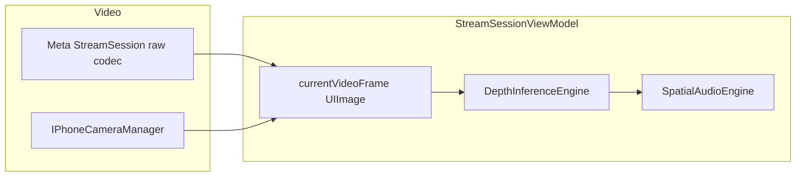

# Yalehacks — Project overview (authoritative)

This document is the **single place** to understand what this repository contains, how the pieces fit together, and how to run it. Some older files (for example `DOCUMENTATION.md`) still mention paths like `DepthanythingTest/`; the **current** iOS app lives under **`NavigatorImpaired/`** only.

---

## 1. What this project is

**NavigatorImpaired** is an **iOS** app built for navigation assistance using **live video**, **monocular depth estimation**, and **spatial audio** (plus optional **haptics**). It can use:

- The **iPhone camera**, or  
- **Meta Ray-Ban / AI glasses** video via Meta’s **Wearables Device Access Toolkit (DAT)** for iOS.

The core idea: run **[Depth Anything V2](https://github.com/DepthAnything/Depth-Anything-V2)** as a **Core ML** model on each frame, interpret the depth map to find walkable “clear path” directions and nearby obstacles, and **sonify** that information through a custom **`SpatialAudioEngine`** (binaural-style cues, obstacle tones, and a “safe direction” chord pad). **`NavigationHapticEngine`** can mirror obstacle proximity with Core Haptics.

On top of that, the app embeds the **VisionClaw**-style **Camera Access** sample: **Gemini Live**, **WebRTC** remote viewing, and **OpenClaw** tooling — so one binary can stream POV video, run depth, talk to Gemini, and share a WebRTC session.

**Typical depth inference** (device-dependent): on the order of **~35–60 ms** per frame once the Neural Engine is warm; first launch includes one-time Core ML compilation for ANE.

---

## 2. Repository layout (what matters)

| Path | Role |
|------|------|
| **`NavigatorImpaired/NavigatorImpaired.xcodeproj`** | Open this in Xcode — main app target **NavigatorImpaired**. |
| **`NavigatorImpaired/NavigatorImpaired/`** | All Swift sources for the shipping app (SwiftUI, depth, audio, VisionClaw UI). |
| **`NavigatorImpaired/NavigatorImpaired/DepthAnythingV2SmallANE.mlpackage`** | **Bundled** Core ML model variant (ANE-oriented naming in code). |
| **`NavigatorImpaired/model/DepthAnythingV2SmallF16.mlpackage`** | Copy of the **Float16** model tree (may mirror HF layout). |
| **`model/DepthAnythingV2SmallF16.mlpackage`** | Another copy at repo root `model/`. |
| **`setup_model.sh`** | Downloads **`DepthAnythingV2SmallF16.mlpackage`** from Hugging Face into **`NavigatorImpaired/NavigatorImpaired/`** if you want the HF small-F16 variant instead of relying only on the ANE package (see §7). |
| **`README.md`** | Quick setup, features, Ray-Ban checklist (still useful; paths may say `DepthanythingTest` in places). |
| **`DOCUMENTATION.md`** | Older architecture write-up; **paths and app name are outdated** — use this file first. |
| **`NavigatorImpaired/Vendor/VisionClaw/`** | Upstream VisionClaw / Meta sample reference tree (not a separate app target). |

**Unit / UI tests:** `NavigatorImpairedTests/`, `NavigatorImpairedUITests/` (standard Xcode scaffolding).

---

## 3. Runtime architecture

### 3.1 App entry and navigation

```
NavigatorImpairedApp (@main)
  → Wearables.configure() once
  → MainAppView
       → If not registered with Meta DAT: HomeScreenView (onboarding)
       → If registered (or mock / skip-to-iPhone): StreamSessionView
            → NonStreamView (start streaming) or StreamView (live)
```

- **`NavigatorImpairedApp`** — Configures **`Wearables`**, owns **`AppViewModel`** (OAuth URLs, errors) and **`WearablesViewModel`**, wires **`onOpenURL`** for Meta callbacks.
- **`MainAppView`** — Routes between registration and **`StreamSessionView`**.
- **`StreamSessionView`** — Owns **`StreamSessionViewModel`**, **`GeminiSessionViewModel`**, **`WebRTCSessionViewModel`**; starts depth model load on appear.

### 3.2 Video and depth pipeline



- **`StreamSessionViewModel`** — **`StreamSession`** with **`AutoDeviceSelector`**, **`VideoCodec.raw`**, configurable resolution; **`StreamingMode`** switches **glasses** vs **iPhone** (`handleStartIPhone`, etc.).
- **`DepthInferenceEngine`** — Loads Core ML (**`VNCoreMLRequest`**), returns **`DepthResult`**: Turbo **colorized** image + **row-major normalized depth** floats for audio/haptics.
- **Two-phase model load:** **`loadFast()`** (CPU+GPU first so inference starts quickly) then **`upgradeToANE()`** (Neural Engine compile / hot-swap; long on first install).

### 3.3 Spatial audio and haptics

- **`SpatialAudioEngine`** — Consumes **`depthMap`**, **`width`**, **`height`** from each successful inference; maintains **clear-path** detection (sustain/progress), **obstacle** FM tones, and a **chord beacon** for favorable direction. Integrates **`NavigationHapticEngine`** for proximity-style haptics.
- **`StreamView`** — When depth + audio are enabled, shows **`ClearPathPanel`** (same conceptual UI as the older **`DepthBenchmarkView`** panel).

### 3.4 VisionClaw features (same binary)

- **Gemini Live** — **`GeminiSessionViewModel`**, transcripts, tool status; **`Secrets.swift`** (from **`Secrets.swift.example`**) for API configuration — **do not commit real keys**.
- **WebRTC** — **`WebRTCSessionViewModel`**, **`PiPVideoView`** when connected; pinned **WebRTC** SPM (see project file; historically **140.0.0** to avoid known header issues).
- **OpenClaw** — Event bridge / tool routing under **`VisionClaw/OpenClaw/`**.

---

## 4. User-facing behavior (streaming screen)

After Meta registration, the user starts streaming from **`NonStreamView`**, then **`StreamView`**:

- **Source** — Segmented control: **Ray-Ban** vs **iPhone**.
- **Depth map** — Toggle enables inference; optional **opacity** and **show depth overlay**.
- **Spatial audio** — Master toggle; shows compute label / ANE upgrade status when relevant.
- **Clear path panel** — Visible when both spatial audio and depth are on — direction, confidence, sustain dots, azimuth bar.
- **Stop streaming**, **photo capture** (glasses mode), **AI** (Gemini), **Live** (WebRTC).

---

## 5. Legacy / secondary screens (still in repo)

- **`DepthBenchmarkView`** + **`DepthBenchmarkViewModel`** — Standalone **depth benchmark** UI (phone + glasses source picker, stats, clear-path panel). **Not** wired as the root in **`NavigatorImpairedApp`** today; the **production flow** is **`MainAppView` → `StreamSessionView`**. Kept for benchmarking or future re-integration.
- **`ContentView.swift`** — Placeholder comment only; entry is **`NavigatorImpairedApp`**.

---

## 6. Prerequisites and setup

**Required**

- macOS, **Xcode** (iOS deployment target per project settings).
- **Physical iPhone** — phone camera path needs a real device; simulator is insufficient for full flows.
- **Apple Developer** signing for device install.

**Optional (Ray-Ban)**

- Meta developer app, **Meta App ID** and **Client Token** as Xcode **User-Defined** build settings (often `META_APP_ID`, `CLIENT_TOKEN`), matching **`Info.plist`** / Meta dashboard.
- Glasses paired in **Meta View**; wearable **camera** permission through the SDK.

**Model download (if you use the script)**

```bash
cd /path/to/Yalehacks
./setup_model.sh
```

The script sets **`HF_HOME`** to **`.hf-home`** so Hugging Face cache does **not** land inside the app folder (duplicate **`.mlpackage`** trees break Xcode with “Multiple commands produce” for Core ML).

**Open the project**

```bash
open NavigatorImpaired/NavigatorImpaired.xcodeproj
```

Swift Package Manager pulls **Meta Wearables DAT** (`MWDATCore`, `MWDATCamera`, optional **`MWDATMockDevice`**) and **WebRTC**.

---

## 7. Core ML model names (important)

`DepthInferenceEngine` resolves the compiled model from the bundle using the base name **`DepthAnythingV2SmallANE`** (see `modelURL()` in **`DepthInferenceEngine.swift`**). The repo includes **`DepthAnythingV2SmallANE.mlpackage`** under the app group.

If you switch to the **Hugging Face** **`DepthAnythingV2SmallF16`** package:

1. Add it to the app target and align the **resource name** in code with **`DepthAnythingV2SmallF16`**, **or** keep filenames consistent with what `DepthInferenceEngine` expects.

The **`setup_model.sh`** script downloads F16 into **`NavigatorImpaired/NavigatorImpaired/DepthAnythingV2SmallF16.mlpackage`** — you must wire the target and naming so the engine finds the right bundle resource.

---

## 8. Performance and troubleshooting (short)

| Topic | Notes |
|--------|--------|
| First launch slow | Core ML **ANE compilation** can take **tens of seconds** once; UI may show loading / upgrading states. |
| “Multiple commands produce” | Remove stray **`.cache`** or duplicate **`.mlpackage`** under synced app folders; use **`.hf-home`** via `setup_model.sh`. |
| Meta OAuth | **`onOpenURL`** must call into **`AppViewModel.handleIncomingURL`**; URL scheme in **Info.plist** must match the Meta app config. |
| Glasses stream black / nil frames | Raw codec + **CVPixelBuffer** fallback paths exist in the view model; check permissions and **`StreamSession`** errors. |

---

## 9. Intellectual property and upstream

- **Depth Anything V2** — Research / model lineage: [Depth-Anything-V2](https://github.com/DepthAnything/Depth-Anything-V2).  
- **Apple Core ML build** on Hugging Face: [apple/coreml-depth-anything-v2-small](https://huggingface.co/apple/coreml-depth-anything-v2-small).  
- **Meta Wearables** — [Developer docs](https://wearables.developer.meta.com/docs/develop/), [meta-wearables-dat-ios](https://github.com/facebook/meta-wearables-dat-ios).  
- **VisionClaw** reference — upstream sample patterns; see **`NavigatorImpaired/Vendor/VisionClaw/LICENSE`**.

---

## 10. Document map

| File | Use when |
|------|----------|
| **`PROJECT_OVERVIEW.md`** (this file) | Full picture of the **current** repo and **NavigatorImpaired** app. |
| **`README.md`** | Fast setup and feature bullets. |
| **`DOCUMENTATION.md`** | Extra detail where still accurate; **ignore outdated paths** to `DepthanythingTest`. |

---

*Last aligned with repository layout and `NavigatorImpaired` sources as of the project state in this workspace.*
